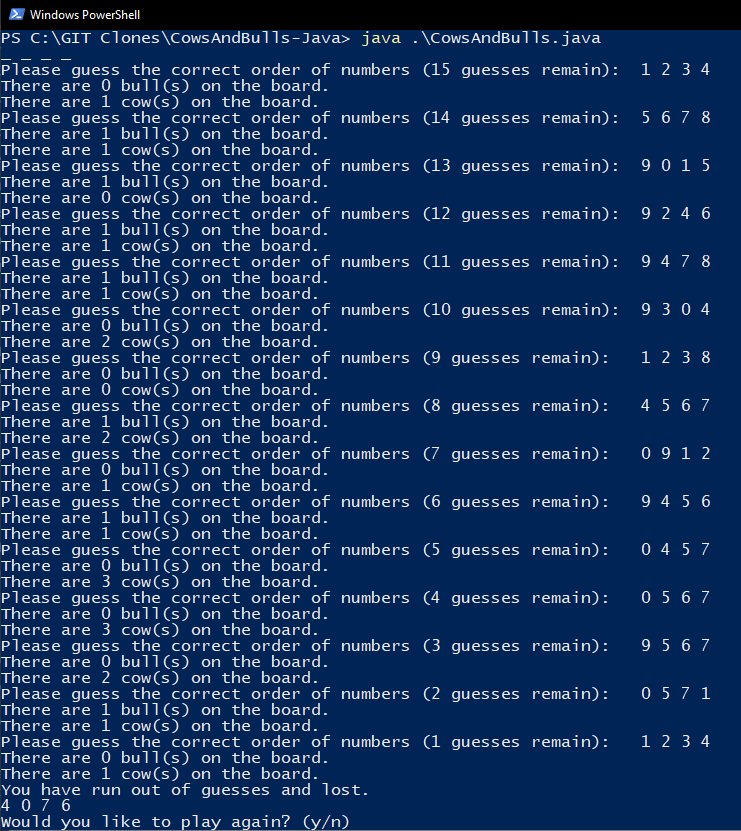

# Cows and Bulls Overview

This is a java program that allows the user to play the game Cows and Bulls. This is a game in which the user has to guess a number and the program tells the user if they have guessed correctly or not by listing the number of cows and bulls in their guess. A cow is a number where which is in the sequence, but not in the correct spot, while a bull is a number that is both in the sequence and the correct position. The player gets 15 guesses to guess the number and whether they win or lose, the program prompts them to play again after the end is reached.

## Screenshot of the Gameplay
